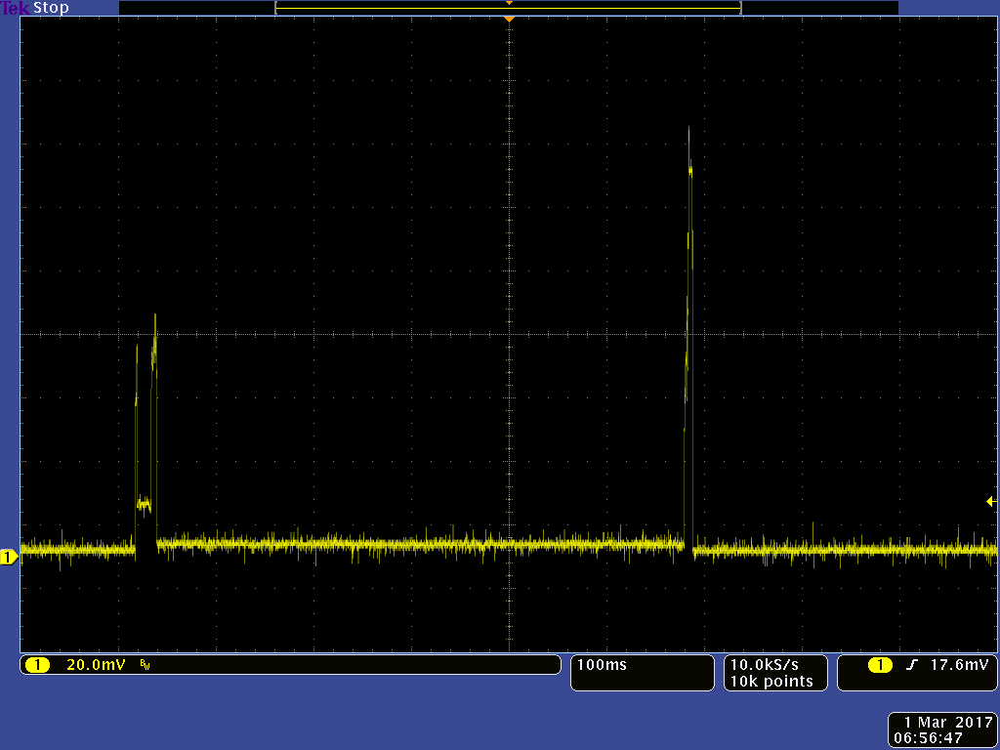
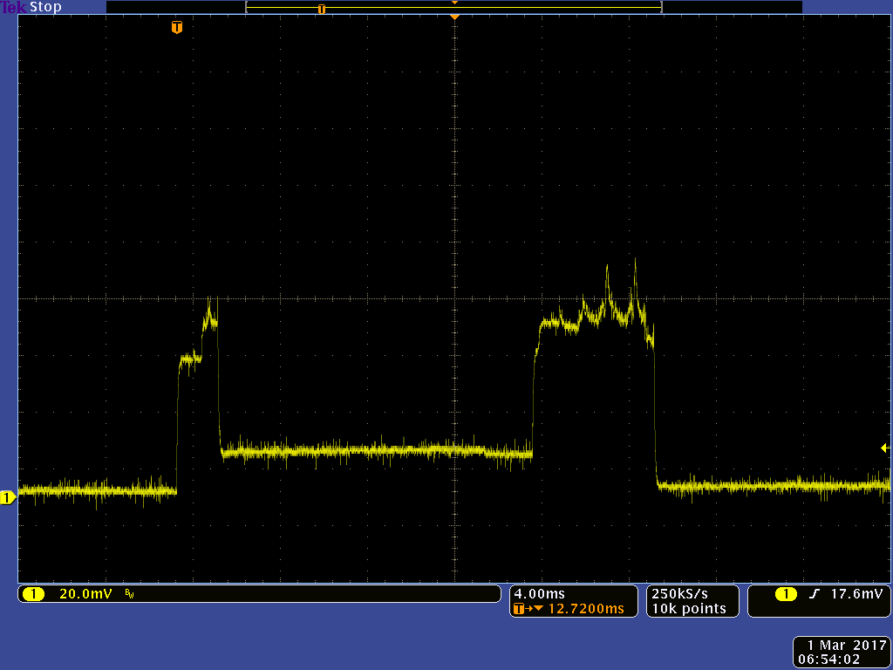
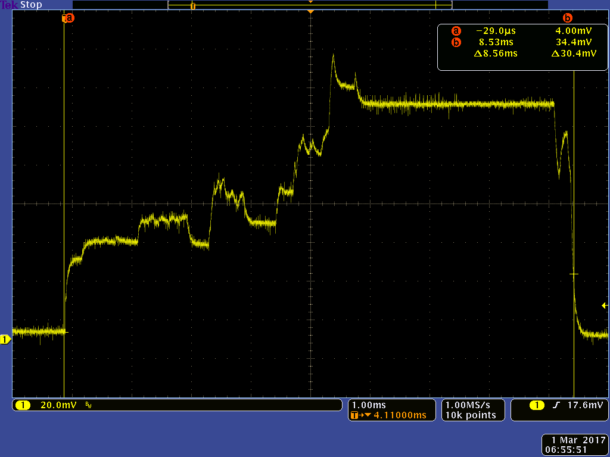
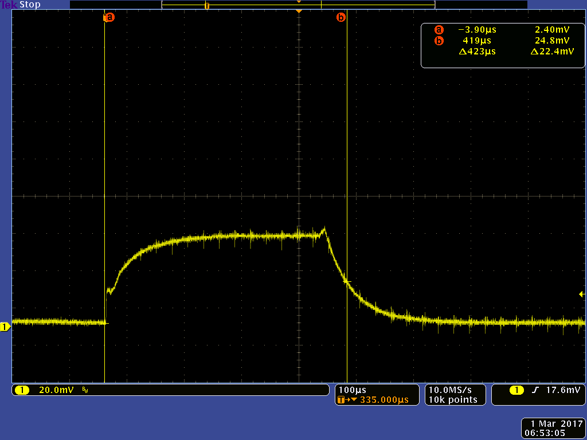

# hamilton-330-qualified-fw
The factory image for hamilton-370/330.

This code will work out the box on the hamilton-370 (with PIR) and hamilton-330.

It senses every SAMPLE_INTERVAL microseconds, encrypts the sensor data under the
symmetric key flashed into the device with pflash, and sends it.

## Average power

The power consumption is not yet finalized 

## Power profile

The power consumption profile looks like the following figure. Due to our measurement technique, the Y axis is only an approximation of the instantaneous power consumption. The average power figures above are far more accurate.

There is a period of approximately 22ms in the beginning where the device senses air temperature and humidity.

Then there is a long period of about 500ms where it senses radiant temperature (the power consumption in this period is about 250uA).
Then it senses illumination, accelerometer and magnetometer, as well as aggregating PIR events and button events.
It then encrypts all this data and transmits it. This second part looks as follows:

If the PIR sensor is triggering, there will be periodic events that look as follows:

These are basically the chip waking up and recording the timestamp of the PIR event for later aggregation.

## Changelog

This is version 1.0 of Hamilton-330 QFW.

